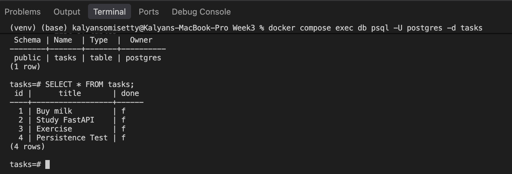

# Week 3 – Task API with PostgreSQL and Docker

This project is part of the FlyRank Backend AI Engineering Internship.

The Task API has progressively moved through three different storage approaches:

* In-memory Python list
* SQLite database
* PostgreSQL running inside Docker

The API behaviour remains largely unchanged while the underlying storage implementation evolves.

The goal of this assignment is to understand how a backend application connects to a real database server, manages configuration securely using environment variables, and runs the complete application stack using Docker Compose.

## Features

* Create a new task
* Retrieve all tasks
* Retrieve a task by ID
* Update an existing task
* Delete a task
* PostgreSQL database persistence
* PostgreSQL running inside Docker
* FastAPI application containerized with Docker
* Full stack started using Docker Compose
* Automatic database table creation
* Automatic insertion of three example tasks when the table is empty
* Parameterized SQL queries using Psycopg
* Environment variables for database configuration
* Docker volume for database persistence
* PostgreSQL health check before API startup
* Input validation and appropriate HTTP status codes
* Interactive API documentation using FastAPI Swagger UI

## Tech Stack

* Python
* FastAPI
* PostgreSQL
* Psycopg
* Docker
* Docker Compose
* Uvicorn
* Pydantic
* python-dotenv

## Database Evolution

The Task API has used three storage approaches during development.

| Version     | Storage               | Persistence                    |
| ----------- | --------------------- | ------------------------------ |
| Initial API | Python list in memory | Lost when application restarts |
| SQLite      | `tasks.db` file       | Stored locally on disk         |
| Current     | PostgreSQL in Docker  | Stored in a Docker volume      |

Although the storage implementation changed, the API endpoints continued to provide the same CRUD functionality.

This demonstrates that the database is an implementation detail behind the API.

## PostgreSQL Database

PostgreSQL runs as a Docker service rather than being installed directly on the machine.

The database contains a `tasks` table with the following columns:

| Column  | Type    | Description                         |
| ------- | ------- | ----------------------------------- |
| `id`    | SERIAL  | Automatically generated primary key |
| `title` | TEXT    | Task title                          |
| `done`  | BOOLEAN | Task completion status              |

The table is created automatically when the application starts if it does not already exist.

If the table is empty, the following three example tasks are inserted:

* Buy milk
* Study FastAPI
* Exercise

The seed operation only runs when the table contains no rows.

## API Endpoints

| Method | Endpoint           | Description             | Success Status |
| ------ | ------------------ | ----------------------- | -------------- |
| GET    | `/tasks`           | Retrieve all tasks      | 200            |
| GET    | `/tasks/{task_id}` | Retrieve a task by ID   | 200            |
| POST   | `/tasks`           | Create a new task       | 201            |
| PUT    | `/tasks/{task_id}` | Update an existing task | 200            |
| DELETE | `/tasks/{task_id}` | Delete an existing task | 204            |

Unknown task IDs return `404 Not Found`.

Invalid empty task titles return `400 Bad Request`.

## Environment Configuration

Database credentials are stored in a local `.env` file.

The real `.env` file is excluded from Git using `.gitignore`.

A safe example configuration is provided in:

```text
.env.example
```

After cloning the repository, create the local environment file with:

```bash
cp .env.example .env
```

Update the values if required.

## How to Run the Project

### 1. Clone the repository

```bash
git clone https://github.com/kalyansomisetty/flyrank-backend-week3.git
cd flyrank-backend-week3
```

### 2. Create the environment file

```bash
cp .env.example .env
```

### 3. Start the complete stack

```bash
docker compose up --build
```

Docker Compose starts:

* the FastAPI application
* the PostgreSQL database

The API waits for PostgreSQL to become healthy before starting.

No separate PostgreSQL installation is required.

### 4. Open Swagger UI

After the containers are running, open:

```text
http://127.0.0.1:8000/docs
```

Swagger UI can be used to test all CRUD endpoints.

## Example Request

Create a new task:

```bash
curl -i -X POST http://127.0.0.1:8000/tasks \
  -H "Content-Type: application/json" \
  -d '{"title":"Learn Docker"}'
```

Example response:

```text
HTTP/1.1 201 Created
content-type: application/json
```

```json
{
  "id": 4,
  "title": "Learn Docker",
  "done": false
}
```

## Parameterized Queries

Psycopg uses `%s` placeholders for parameterized SQL queries.

For example:

```python
cursor.execute(
    "SELECT * FROM tasks WHERE id = %s",
    (task_id,)
)
```

The user-provided value is passed separately from the SQL statement.

This is safer than combining user input directly into the SQL string.

## Docker Compose

The application contains two Docker Compose services:

### `api`

Runs the FastAPI application.

### `db`

Runs the official PostgreSQL Docker image.

Inside the Docker Compose network, the API connects to PostgreSQL using the service name:

```text
db
```

instead of:

```text
localhost
```

Docker Compose provides internal networking between the two services.

## Database Persistence

PostgreSQL data is stored in a named Docker volume:

```text
taskdata
```

This means database rows survive container restarts.

Persistence was tested using:

```bash
docker compose down
docker compose up
```

Tasks created before shutting down the stack were still present after restarting it.

Without a Docker volume, database data would disappear when the database container is removed.

## PostgreSQL Health Check

The database service includes a health check using:

```text
pg_isready
```

The FastAPI container waits until PostgreSQL reports that it is healthy before starting.

This prevents the API from attempting to connect while PostgreSQL is still initializing.

## Database Screenshot

The screenshot below shows the `tasks` table and its stored rows inside PostgreSQL.



## What I Learned

Through this assignment, I learned how to:

* Run PostgreSQL using Docker
* Understand the difference between Docker images and containers
* Connect Python to PostgreSQL using Psycopg
* Store database configuration in environment variables
* Keep credentials outside source code and Git
* Use `.env` and `.env.example`
* Create PostgreSQL tables automatically
* Seed initial database records only when required
* Use PostgreSQL `SERIAL` primary keys
* Use parameterized queries with `%s` placeholders
* Perform CRUD operations against PostgreSQL
* Containerize a FastAPI application using a Dockerfile
* Run an API and database together using Docker Compose
* Use Docker service names for container-to-container communication
* Use a Docker volume for persistent database storage
* Use a health check to wait for PostgreSQL before starting the API
* Keep the API behaviour consistent while replacing the storage implementation

## Project Structure

```text
Week3/
├── main.py
├── database.py
├── Dockerfile
├── compose.yaml
├── requirements.txt
├── .env
├── .env.example
├── .gitignore
├── README.md
└── screenshots/
    └── postgres-database.png
```

The `.env` file is ignored by Git and is not included in the repository.

## Assignment Progress

* Stage 0 – PostgreSQL in Docker ✅
* Stage 1 – Connect using `.env` and create table ✅
* Stage 2 – Read tasks from PostgreSQL ✅
* Stage 3 – Full CRUD using PostgreSQL ✅
* Stage 4 – Docker Compose full stack ✅
* Stage 5 – Documentation and publishing ✅

## Author

**Venkata Naga Sri Kalyan Somisetty**
Backend AI Engineer Intern – FlyRank AI