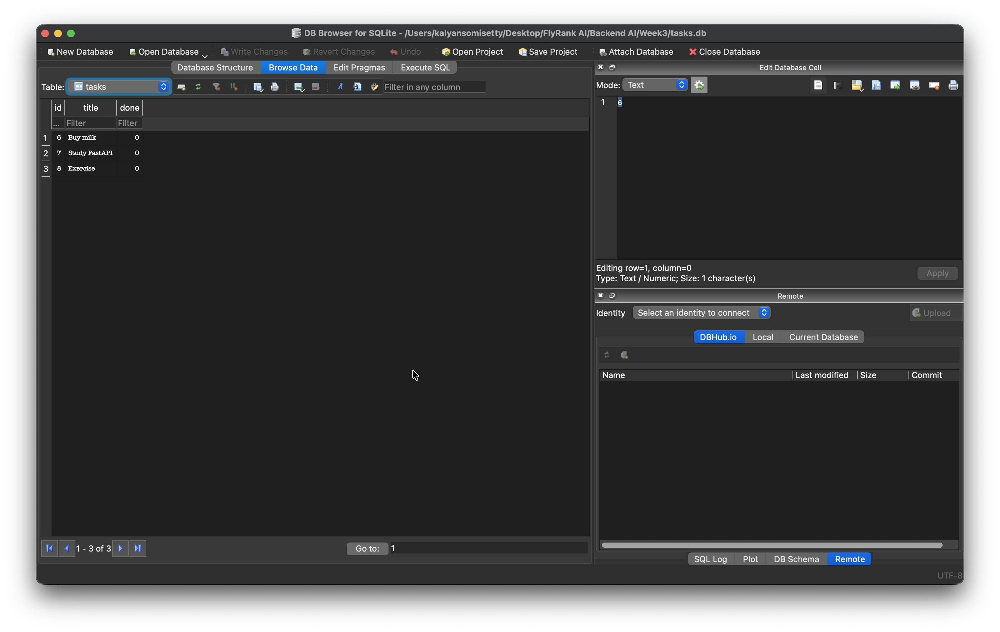

# Week 3 – Task API with SQLite

This project is part of the FlyRank Backend AI Engineering Internship.

In Week 2, the Task API stored tasks in an in-memory Python list. In Week 3, the API was updated to use a SQLite database while keeping the same CRUD API behaviour.

The main goal of this assignment is to understand database persistence and the separation between the API layer and the data storage layer.

## Features

- Create a new task
- Retrieve all tasks
- Retrieve a task by ID
- Update an existing task
- Delete a task
- SQLite database persistence
- Automatic database and table creation
- Automatic insertion of three example tasks when the table is empty
- Input validation and appropriate HTTP status codes
- Interactive API documentation using FastAPI Swagger UI

## Tech Stack

- Python
- FastAPI
- SQLite
- Python `sqlite3` module
- Uvicorn
- Pydantic

## Why SQLite?

SQLite was chosen because it is lightweight and does not require a separate database server.

Python provides built-in support for SQLite through the `sqlite3` module, making it simple to integrate into a small backend project.

SQLite also stores the database in a single local file, which makes it suitable for learning database persistence and SQL without requiring additional database infrastructure.

## Database

The SQLite database is stored locally as:

```text
tasks.db
```

The database file is created automatically in the project's root directory when the application starts if it does not already exist.

The `tasks` table is also created automatically.

The table contains the following columns:

| Column | Type | Description |
|--------|------|-------------|
| `id` | INTEGER | Primary key with automatic increment |
| `title` | TEXT | Task title |
| `done` | BOOLEAN | Completion status of the task |

If the table is empty, the application automatically inserts three example tasks:

- Buy milk
- Study FastAPI
- Exercise

The `tasks.db` file is excluded from Git using `.gitignore`. Therefore, someone cloning the repository can start the application and a new database will be created automatically.

## API Endpoints

| Method | Endpoint | Description | Success Status |
|---|---|---|---|
| GET | `/tasks` | Retrieve all tasks | 200 |
| GET | `/tasks/{task_id}` | Retrieve a task by ID | 200 |
| POST | `/tasks` | Create a new task | 201 |
| PUT | `/tasks/{task_id}` | Update an existing task | 200 |
| DELETE | `/tasks/{task_id}` | Delete an existing task | 204 |

Unknown task IDs return a `404 Not Found` response.

Invalid task titles return a `400 Bad Request` response.

## How to Run the Project

### 1. Clone the repository

```bash
git clone https://github.com/kalyansomisetty/flyrank-backend-week3.git
cd flyrank-backend-week3
```

### 2. Create a virtual environment

```bash
python3 -m venv venv
```

### 3. Activate the virtual environment

On macOS/Linux:

```bash
source venv/bin/activate
```

On Windows:

```bash
venv\Scripts\activate
```

### 4. Install the dependencies

```bash
pip install -r requirements.txt
```

### 5. Start the FastAPI server

```bash
uvicorn main:app --reload
```

The application will automatically create `tasks.db`, create the `tasks` table if necessary, and insert the example tasks if the table is empty.

### 6. Open Swagger UI

After starting the server, open:

```text
http://127.0.0.1:8000/docs
```

Swagger UI can be used to test all CRUD endpoints.

## Example Request

Create a new task:

```http
POST /tasks
```

Request body:

```json
{
  "title": "Learn SQLite"
}
```

Example response:

```json
{
  "id": 4,
  "title": "Learn SQLite",
  "done": false
}
```

Status:

```text
201 Created
```

## SQL Queries Explored

During the assignment, SQLite was also accessed directly to understand basic SQL operations.

### List all tasks

```sql
SELECT * FROM tasks;
```

### Show completed tasks

```sql
SELECT * FROM tasks WHERE done = 1;
```

### Count all tasks

```sql
SELECT COUNT(*) FROM tasks;
```

### Mark all tasks as completed

```sql
UPDATE tasks SET done = 1;
```

### Delete all completed tasks

```sql
DELETE FROM tasks WHERE done = 1;
```

Changes made directly to the SQLite database are reflected by the API because the API reads its task data from the database.

## Database Screenshot

The screenshot below shows the `tasks` table stored in SQLite.



## What I Learned

Through this assignment, I learned how to:

- Connect Python to a SQLite database
- Create a database and table automatically
- Execute SQL queries using a cursor
- Use parameterized SQL queries with `?` placeholders
- Use `fetchone()` and `fetchall()` to retrieve database results
- Use `INSERT`, `SELECT`, `UPDATE`, and `DELETE`
- Use `commit()` to persist database changes
- Retrieve automatically generated IDs using `lastrowid`
- Store boolean values in SQLite
- Connect FastAPI CRUD endpoints to persistent database storage
- Keep the API behaviour consistent while changing the underlying storage implementation
- Verify database changes directly using SQLite

## Project Structure

```text
Week3/
├── main.py
├── database.py
├── requirements.txt
├── README.md
├── .gitignore
└── tasks.db    # Created automatically and ignored by Git
```

## Assignment Progress

- Stage 0 – Create SQLite database ✅
- Stage 1 – Database read endpoints ✅
- Stage 2 – Insert into database ✅
- Stage 3 – Update and delete with SQL ✅
- Stage 4 – Explore SQLite and SQL queries ✅
- Stage 5 – Database documentation ✅